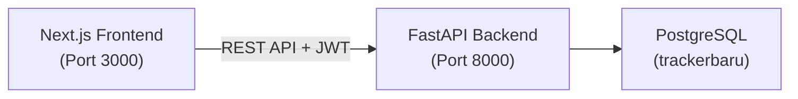

# Migrasi Portfolio Tracker: Flask → FastAPI + Next.js

Migrasi aplikasi Portfolio Tracker dari arsitektur Flask (monolith + Jinja templates) ke arsitektur modern **FastAPI** (backend API) + **Next.js + React** (frontend SPA) dengan database **PostgreSQL** (`trackerbaru`).

## Arsitektur Baru



## User Review Required

> [!IMPORTANT]
> **Database**: Saya akan menggunakan database `trackerbaru` yang sudah ada (kosong) dan membuat tabel-tabel baru di dalamnya. Data lama di `jurnal_db` **tidak** akan disentuh/dimigrasi. Apakah ini sesuai?

> [!IMPORTANT]  
> **Struktur Proyek**: Saya akan membuat 2 subfolder dalam `d:\Project Python\integrasiapp`:
> - `backend/` — FastAPI server
> - `frontend/` — Next.js app
> 
> File lama (app.py, templates/, dll) tetap utuh.

> [!WARNING]
> **Password default PostgreSQL**: `postgres`. Ini akan disimpan di file `.env` lokal (bukan di-commit ke Git).

## Open Questions

1. **User accounts**: Apakah saya perlu membuatkan user default (DRV1, DRV2) saat setup database, seperti di sistem lama?
2. **Data migration**: Apakah Anda ingin data dari `jurnal_db` dimigrasikan ke `trackerbaru`, atau mulai fresh?

---

## Proposed Changes

### Database Schema (PostgreSQL `trackerbaru`)

Membuat 4 tabel yang sama dengan `jurnal_db` tetapi di database baru:

| Tabel | Deskripsi |
|-------|-----------|
| `users` | User accounts (id, username, password_hash, is_admin, created_at) |
| `saldo` | Cash balance per user (total, referensi) |
| `portofolio` | Semua transaksi BELI/JUAL (nama_aset, jumlah, harga_beli, fee, tanggal_beli, jenis_transaksi, profit_loss, strategy, kategori) |
| `activity_log` | Activity log (user_id, username, action, detail, ip_address, user_agent, created_at) |

---

### Backend — FastAPI

#### [NEW] `backend/` directory structure

```
backend/
├── main.py              # FastAPI app + CORS
├── config.py            # Settings (DB URL, JWT secret)
├── database.py          # SQLAlchemy async engine + session
├── models.py            # SQLAlchemy ORM models
├── schemas.py           # Pydantic request/response schemas
├── auth.py              # JWT auth (login, token, dependency)
├── init_db.py           # DB init script (create tables + default users)
├── requirements.txt     # Python dependencies
├── .env                 # Environment variables
└── routers/
    ├── transactions.py  # CRUD transaksi (BUY/SELL + P/L logic)
    ├── portfolio.py     # Dashboard data + chart data
    ├── analytics.py     # KPI, donut chart, heatmap, top assets
    ├── strategy.py      # Strategy analytics
    ├── admin.py         # Admin dashboard (users, logs, storage)
    ├── market.py        # Market data (yfinance download)
    └── benchmark.py     # Benchmark comparison API
```

**Key features:**
- **SQLAlchemy ORM** (bukan raw psycopg2) untuk type-safety
- **JWT Authentication** (bukan session cookies) — lebih cocok untuk SPA
- **Pydantic schemas** untuk validasi request/response
- **CORS middleware** agar frontend Next.js bisa akses API
- **Semua business logic** (P/L calculation, cycle detection, saldo management) dimigrasi 1:1

**Dependencies baru (backend/requirements.txt):**
```
fastapi>=0.115.0
uvicorn[standard]>=0.32.0
sqlalchemy>=2.0.0
psycopg2-binary>=2.9.0
python-dotenv>=1.0.0
python-jose[cryptography]>=3.3.0
passlib[bcrypt]>=1.7.0
yfinance>=0.2.0
pandas>=2.0.0
pydantic>=2.0.0
```

---

### Frontend — Next.js + React

#### [NEW] `frontend/` directory structure

```
frontend/
├── package.json
├── next.config.js
├── .env.local
├── public/
│   └── login_bg.png      # Copy dari static/
├── src/
│   ├── app/
│   │   ├── layout.js      # Root layout + global font (Inter)
│   │   ├── globals.css     # Design system (dark theme, glassmorphism)
│   │   ├── page.js         # Dashboard (main page, protected)
│   │   ├── login/
│   │   │   └── page.js     # Login page
│   │   ├── analytics/
│   │   │   └── page.js     # Analytics page
│   │   ├── strategy/
│   │   │   └── page.js     # Strategy analytics
│   │   ├── admin/
│   │   │   └── page.js     # Admin dashboard
│   │   └── market/
│   │       └── page.js     # Market data
│   ├── components/
│   │   ├── Sidebar.js      # Navigation sidebar (futuristic)
│   │   ├── StatsCard.js    # Animated stat card
│   │   ├── TransactionTable.js  # Data table with filters
│   │   ├── TransactionForm.js   # Add/Edit transaction modal
│   │   ├── PnLChart.js     # Plotly.js chart component
│   │   ├── DonutChart.js   # Portfolio composition
│   │   ├── HeatmapGrid.js  # Monthly performance heatmap
│   │   ├── ProtectedRoute.js    # Auth guard wrapper
│   │   └── Toast.js        # Notification toasts
│   └── lib/
│       ├── api.js          # Axios API client (base URL, JWT interceptor)
│       └── auth.js         # Auth context (React Context + localStorage)
```

**Desain UI Futuristik:**
- 🎨 **Dark theme** dengan glassmorphism effects
- ✨ **Gradient accents** (orange-gold primary, emerald-green profit, red loss)
- 🎭 **Micro-animations**: fade-in cards, shimmer titles, hover glow effects
- 📊 **Interactive charts**: Plotly.js dengan dark theme
- 🧭 **Sidebar navigation** (collapsible, dengan icons + active state glow)
- 📱 **Fully responsive** layout

**Dependencies baru (frontend - npm):**
```
next, react, react-dom
plotly.js-dist, react-plotly.js
axios
lucide-react (icons)
```

---

### Fitur yang Akan Dimigrasi (1:1)

| # | Fitur | Backend Route | Frontend Page |
|---|-------|--------------|---------------|
| 1 | Login / Logout | `POST /api/auth/login` | `/login` |
| 2 | Dashboard utama (saldo, P/L summary, chart) | `GET /api/portfolio/dashboard` | `/` |
| 3 | Tambah transaksi (BELI/JUAL + P/L calc) | `POST /api/transactions` | `/` (modal form) |
| 4 | Edit transaksi | `PUT /api/transactions/{id}` | `/` (modal form) |
| 5 | Hapus transaksi | `DELETE /api/transactions/{id}` | `/` (confirm dialog) |
| 6 | Tambah modal (top-up saldo) | `POST /api/portfolio/topup` | `/` (section) |
| 7 | Download report CSV | `GET /api/portfolio/report/{range}` | `/` (download link) |
| 8 | Filter transaksi (date, ticker, type, P/L, strategy) | Client-side filtering | `/` |
| 9 | Analytics (donut, KPI, heatmap, top assets, benchmark) | `GET /api/analytics/...` | `/analytics` |
| 10 | Strategy analytics | `GET /api/strategy/...` | `/strategy` |
| 11 | Admin dashboard (users, logs, storage) | `GET /api/admin/...` | `/admin` |
| 12 | Market data download (YFinance) | `POST /api/market/download` | `/market` |
| 13 | Benchmark comparison | `GET /api/benchmark` | `/analytics` |
| 14 | CSV Import (broker: Ajaib, Stockbit, IPOT) | `POST /api/market/import` | `/market` |

---

## Verification Plan

### Automated Tests
1. **Backend**: Start FastAPI server, verify all API endpoints return correct data
2. **Frontend**: Start Next.js dev server, verify pages render correctly
3. **Database**: Verify tables are created in `trackerbaru` with correct schema
4. **Auth flow**: Test login → get JWT → access protected routes → logout

### Manual Verification
- Browse frontend at `http://localhost:3000`
- Test full transaction flow: Login → Add BELI → Add JUAL → Check P/L → View Analytics
- Verify responsive layout on different screen sizes
